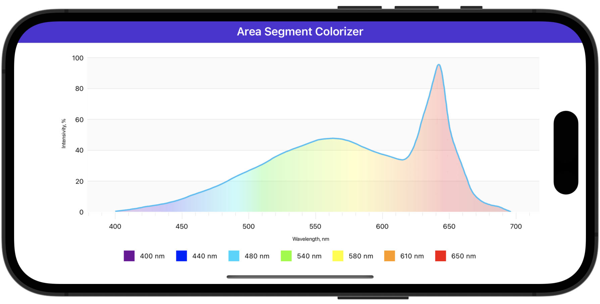

# Colorize Area Segments

In this example, the area chart visualizes the visible light spectrum.

<!-- default file list -->
## Files to Review

* [MainPage.xaml](./MainPage.xaml)
* [ViewModel.cs](./ViewModel.cs)
<!-- default file list end -->

## Documentation

[SegmentBasedFillColorizer](https://docs.devexpress.com/MAUI/DevExpress.Maui.Charts.SegmentBasedFillColorizer)