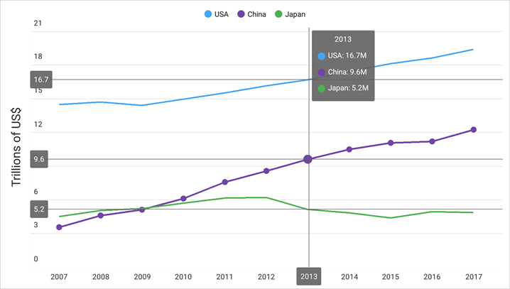

<!-- default file list -->
*Files to look at*:

* [Startup.cs](./ChartViewExample/ChartViewExample/Startup.cs)
* [MainPage.xaml](./ChartViewExample/ChartViewExample/MainPage.xaml)
* [ViewModel.cs](./ChartViewExample/ChartViewExample/ViewModel.cs)
<!-- default file list end -->

# DevExpress Cartesian Chart for .NET MAUI 

The DevExpress ChartView for for .NET MAUI Preview 5 can visualize data in the [Cartesian coordinate system](https://en.wikipedia.org/wiki/Cartesian_coordinate_system) as areas, bars, points, bubbles, lines, and other forms. 

This example allows you to get started with the ChartView component and explore its basic functionality. It demonstrates how to add data series to a chart, configure axes, specify the chart's elements (legend, series labels, and hints), and customize series appearance.

Open the solution in Visual Studio 16.11 Preview 2 and restore NuGet packages to run the application:

1. [Obtain your NuGet feed URL](http://docs.devexpress.com/GeneralInformation/116042/installation/install-devexpress-controls-using-nuget-packages/obtain-your-nuget-feed-url).
2. Register the DevExpress NuGet feed as a package source.
3. Restore all NuGet packages for the solution.

Run the application on an Android device or emulator.



The following step-by-step instructions describe how to create the same application:
## Create a New MAUI Application and Add a Chart

Create a new .NET MAUI solution in Visual Studio 16.11 Preview 2.  
Refer to the following Microsoft topic for more information on how to get started with .NET MAUI: [.NET Multi-platform App UI documentation](https://docs.microsoft.com/en-gb/dotnet/maui/).

Add the DevExpress Charts component to your solution as follows: 
1. Obtain your NuGet feed URL.
2. Register the DevExpress NuGet feed as a package source. 
3. Install the **DevExpress.MAUI.Charts** package from the DevExpress NuGet feed.

In the *Startup.cs* file, register a handler for the DevExpress ChartView:

```cs
using Microsoft.Maui;
using Microsoft.Maui.Hosting;
using Microsoft.Maui.Controls.Hosting;
using DevExpress.Maui.Charts;

namespace ChartViewExample {
	public class Startup : IStartup {
		public void Configure(IAppHostBuilder appBuilder) {
			appBuilder
				.ConfigureMauiHandlers((_, handlers) => handlers.AddHandler<ChartView, ChartViewHandler>())
				.UseMauiApp<App>()
				.ConfigureFonts(fonts => {
					fonts.AddFont("OpenSans-Regular.ttf", "OpenSansRegular");
				});
		}
	}
}
```
In the *MainPage.xaml* file, use the *dxc* prefix to declare the **DevExpress.Maui.Charts** namespace and add a **ChartView** instance to the ContentPage:
```xaml
<ContentPage xmlns="http://schemas.microsoft.com/dotnet/2021/maui"
             xmlns:x="http://schemas.microsoft.com/winfx/2009/xaml"
             x:Class="ChartViewExample.MainPage"
             xmlns:dxc="clr-namespace:DevExpress.Maui.Charts;assembly=DevExpress.Maui.Charts">
    <dxc:ChartView>
    </dxc:ChartView>
</ContentPage>
```

## Populate the Chart with Data
In this example, the chart contains three line series that show annual GDP for three countries. Create a *ViewModel.cs* file with the following classes:

```cs
public class ViewModel {
    public CountryGdp GdpValueForUSA { get; }
    public CountryGdp GdpValueForChina { get; }
    public CountryGdp GdpValueForJapan { get; }
    
    public ViewModel() {
        GdpValueForUSA = new CountryGdp(
            "USA",
            new GdpValue(new DateTime(2017, 1, 1), 19.391),
            new GdpValue(new DateTime(2016, 1, 1), 18.624),
            new GdpValue(new DateTime(2015, 1, 1), 18.121),
            new GdpValue(new DateTime(2014, 1, 1), 17.428),
            new GdpValue(new DateTime(2013, 1, 1), 16.692),
            new GdpValue(new DateTime(2012, 1, 1), 16.155),
            new GdpValue(new DateTime(2011, 1, 1), 15.518),
            new GdpValue(new DateTime(2010, 1, 1), 14.964),
            new GdpValue(new DateTime(2009, 1, 1), 14.419),
            new GdpValue(new DateTime(2008, 1, 1), 14.719),
            new GdpValue(new DateTime(2007, 1, 1), 14.478)
        );
        GdpValueForChina = new CountryGdp(
            "China",
            new GdpValue(new DateTime(2017, 1, 1), 12.238),
            new GdpValue(new DateTime(2016, 1, 1), 11.191),
            new GdpValue(new DateTime(2015, 1, 1), 11.065),
            new GdpValue(new DateTime(2014, 1, 1), 10.482),
            new GdpValue(new DateTime(2013, 1, 1), 9.607),
            new GdpValue(new DateTime(2012, 1, 1), 8.561),
            new GdpValue(new DateTime(2011, 1, 1), 7.573),
            new GdpValue(new DateTime(2010, 1, 1), 6.101),
            new GdpValue(new DateTime(2009, 1, 1), 5.110),
            new GdpValue(new DateTime(2008, 1, 1), 4.598),
            new GdpValue(new DateTime(2007, 1, 1), 3.552)
        );
        GdpValueForJapan = new CountryGdp(
            "Japan",
            new GdpValue(new DateTime(2017, 1, 1), 4.872),
            new GdpValue(new DateTime(2016, 1, 1), 4.949),
            new GdpValue(new DateTime(2015, 1, 1), 4.395),
            new GdpValue(new DateTime(2014, 1, 1), 4.850),
            new GdpValue(new DateTime(2013, 1, 1), 5.156),
            new GdpValue(new DateTime(2012, 1, 1), 6.203),
            new GdpValue(new DateTime(2011, 1, 1), 6.156),
            new GdpValue(new DateTime(2010, 1, 1), 5.700),
            new GdpValue(new DateTime(2009, 1, 1), 5.231),
            new GdpValue(new DateTime(2008, 1, 1), 5.038),
            new GdpValue(new DateTime(2007, 1, 1), 4.515)
        );
    }
}

public class CountryGdp {
    public string CountryName { get; }
    public IList<GdpValue> Values { get; }

    public CountryGdp(string country, params GdpValue[] values) {
        this.CountryName = country;
        this.Values = new List<GdpValue>(values);
    }
}

public class GdpValue {
    public DateTime Year { get; }
    public double Value { get; }

    public GdpValue(DateTime year, double value) {
        this.Year = year;
        this.Value = value;
    }
}
```

In the *MainPage.xaml* file, add three **LineSeries** objects to the **ChartView.Series** collection. To bind series to data, set the **Data** property of each **LineSeries** object to a **SeriesDataAdapter** object. Use the adapter’s properties to specify the data source and its fields that contain arguments and values for each series:

```xaml
<ContentPage xmlns="http://schemas.microsoft.com/dotnet/2021/maui"
             xmlns:x="http://schemas.microsoft.com/winfx/2009/xaml"
             x:Class="ChartViewExample.MainPage"
             xmlns:local="clr-namespace:ChartViewExample"
             xmlns:dxc="clr-namespace:DevExpress.Maui.Charts;assembly=DevExpress.Maui.Charts">
    <ContentPage.BindingContext>
        <local:ViewModel/>
    </ContentPage.BindingContext>
    <dxc:ChartView>
        <dxc:ChartView.Series>
            <dxc:LineSeries DisplayName="{Binding GdpValueForUSA.CountryName}">
                <dxc:LineSeries.Data>
                    <dxc:SeriesDataAdapter DataSource="{Binding GdpValueForUSA.Values}"
                                           ArgumentDataMember="Year">
                        <dxc:ValueDataMember Type="Value" Member="Value"/>
                    </dxc:SeriesDataAdapter>
                </dxc:LineSeries.Data>
            </dxc:LineSeries>

            <dxc:LineSeries DisplayName="{Binding GdpValueForChina.CountryName}">
                <dxc:LineSeries.Data>
                    <dxc:SeriesDataAdapter DataSource="{Binding GdpValueForChina.Values}"
                                           ArgumentDataMember="Year">
                        <dxc:ValueDataMember Type="Value" Member="Value"/>
                    </dxc:SeriesDataAdapter>
                </dxc:LineSeries.Data>
            </dxc:LineSeries>

            <dxc:LineSeries DisplayName="{Binding GdpValueForJapan.CountryName}">
                <dxc:LineSeries.Data>
                    <dxc:SeriesDataAdapter DataSource="{Binding GdpValueForJapan.Values}"
                                           ArgumentDataMember="Year">
                        <dxc:ValueDataMember Type="Value" Member="Value"/>
                    </dxc:SeriesDataAdapter>
                </dxc:LineSeries.Data>
            </dxc:LineSeries>
        </dxc:ChartView.Series>
    </dxc:ChartView>
</ContentPage>
```

## Configure Chart Axes
Assign a **DateTimeAxisX** object with the specified settings to the **ChartView.AxisX** property to configure the X-axis so that it shows labels for years:
```xaml
<dxc:ChartView>
    <dxc:ChartView.AxisX>
        <dxc:DateTimeAxisX MeasureUnit="Year" 
                           GridAlignment="Year" 
                           GridSpacing="1"/>
    </dxc:ChartView.AxisX>
</dxc:ChartView>
```

Set the **ChartView.AxisY** property to a **NumericAxisY** object, and specify this object's **Title** and **Label** properties to configure the title and labels of the Y-axis:
```xaml
<dxc:ChartView> 
<!-- The X-axis config is here. -->
    <dxc:ChartView.AxisY>
        <dxc:NumericAxisY>
            <dxc:NumericAxisY.Title>
                <dxc:AxisTitle Text="Trillions of US$">
                    <dxc:AxisTitle.Style>
                        <dxc:TitleStyle>
                            <dxc:TitleStyle.TextStyle>
                                <dxc:TextStyle Size="16"/>
                            </dxc:TitleStyle.TextStyle>
                        </dxc:TitleStyle>
                    </dxc:AxisTitle.Style>
                </dxc:AxisTitle>
            </dxc:NumericAxisY.Title>
            <dxc:NumericAxisY.Label>
                <dxc:AxisLabel TextFormat="#.#" Position="Inside"/>
            </dxc:NumericAxisY.Label>
        </dxc:NumericAxisY>
    </dxc:ChartView.AxisY>
</dxc:ChartView>
```

## Add a Legend to the Chart

Set the **ChartView.Legend** property to a **Legend** object, and use this object's properties to configure the legend position and orientation:
```xaml
<dxc:ChartView>
    <dxc:ChartView.Legend>
        <dxc:Legend VerticalPosition="TopOutside" 
                    HorizontalPosition="Center" 
                    Orientation="LeftToRight"/>
    </dxc:ChartView.Legend>
</dxc:ChartView>
```

## Enable a Crosshair Cursor
Set up the chart so that it shows a series point hint as a crosshair cursor, and specify the hint’s content, data format, and visibility options.
1. Set the **ChartView.Hint** property to a **Hint** object, and assign a **CrosshairHintBehavior** object to **Hint.Behavior**.
2. Set the **LineSeries.HintOptions** property to a **SeriesCrosshairOptions** object with the specified settings.

```xaml
<ContentPage.Resources>
    <dxc:SeriesCrosshairOptions x:Key="lineSeriesHintOptions"
                                PointTextPattern="{}{S}: {V}M"
                                ShowInLabel="True"
                                AxisLabelVisible="True"
                                AxisLineVisible="True"/>
</ContentPage.Resources>
<dxc:ChartView>
    <dxc:ChartView.Hint>
        <dxc:Hint>
            <dxc:Hint.Behavior>
                <dxc:CrosshairHintBehavior GroupHeaderTextPattern="{}{A$YYYY}" 
                                           MaxSeriesCount="3"/>
            </dxc:Hint.Behavior>
        </dxc:Hint>
    </dxc:ChartView.Hint>

    <dxc:ChartView.Series>
        <dxc:LineSeries HintOptions="{StaticResource lineSeriesHintOptions}">
            <!--Series Data-->
        </dxc:LineSeries>
        <dxc:LineSeries HintOptions="{StaticResource lineSeriesHintOptions}">
            <!--Series Data-->
        </dxc:LineSeries>
        <dxc:LineSeries HintOptions="{StaticResource lineSeriesHintOptions}">
            <!--Series Data-->
        </dxc:LineSeries>
    </dxc:ChartView.Series>    
</dxc:ChartView>
```

## Modify the Chart Appearance
Set the **LineSeries.MarkersVisible** property to **True** to display point markers.

To change the line series appearance, set the **LineSeries.Style** property to a **LineSeriesStyle** object. This object’s properties allow you to configure the appearance of the series line (**Stroke**, **StrokeThickness**) and point markers (**MarkerSize**, **MarkerStyle**). 

```xaml
<dxc:LineSeries MarkersVisible="True">
    <!--Series Data-->
    <dxc:LineSeries.Style>
        <dxc:LineSeriesStyle Stroke="#7145a7" StrokeThickness="2" MarkerSize="8">
            <dxc:LineSeriesStyle.MarkerStyle>
                <dxc:MarkerStyle Fill="#7145a7"/>
            </dxc:LineSeriesStyle.MarkerStyle>
        </dxc:LineSeriesStyle>
    </dxc:LineSeries.Style>
</dxc:LineSeries>
```
