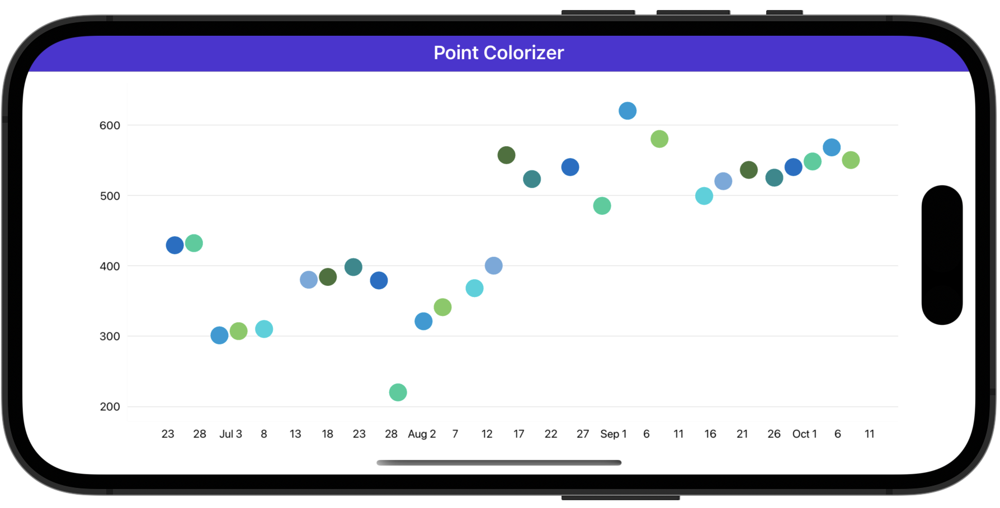

# Paint Points with Palette Colors

This example demonstrates how to paint series points with colors from the specified palette.

Follow the steps below to show such a chart:

* Add a [PointSeries](https://docs.devexpress.com/MAUI/DevExpress.Maui.Charts.PointSeries) object to the [ChartView.Series](https://docs.devexpress.com/MAUI/DevExpress.Maui.Charts.ChartView.Series) collection, and set its [Data](https://docs.devexpress.com/MAUI/DevExpress.Maui.Charts.XYSeries.Data) property to bind the series to a data source.
* Initialize the [PointSeries.PointColorizer](https://docs.devexpress.com/MAUI/DevExpress.Maui.Charts.PointSeries.PointColorizer) property with a [ColorEachPointColorizer](https://docs.devexpress.com/MAUI/DevExpress.Maui.Charts.ColorEachPointColorizer) object. To populate the series palette with colors, set the [ColorEachPointColorizer.Palette](https://docs.devexpress.com/MAUI/DevExpress.Maui.Charts.ColorEachPointColorizer.Palette) property to an array of [Color](https://learn.microsoft.com/en-us/dotnet/api/microsoft.maui.graphics.color?view=net-maui-7.0) objects. 

<!-- default file list -->
## Files to Review

* [MainPage.xaml](./MainPage.xaml)
* [ViewModel.cs](./ViewModel.cs)
<!-- default file list end -->

## Documentation

* [ChartView](https://docs.devexpress.com/MAUI/DevExpress.Maui.Charts.ChartView)
* [ColorEachPointColorizer](https://docs.devexpress.com/MAUI/DevExpress.Maui.Charts.ColorEachPointColorizer)