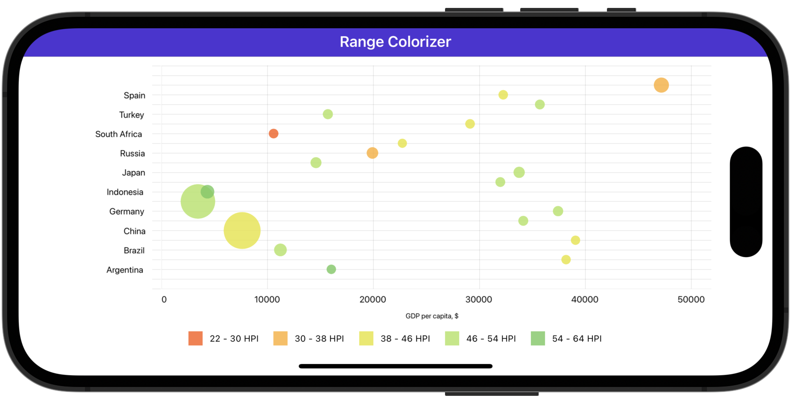

# Paint Bubbles Based on Data Source Field Value Ranges

In this example, the bubble chart displays GDP values for the G20. A point's size indicates the country population and the color indicates the [HPI](https://en.wikipedia.org/wiki/Happy_Planet_Index).

In this example, each data source item that is used to create a bubble contains four values:

* **Country** - Stores data for bubble arguments shown on the x-axis.
* **Gdp** - Stores data for bubble values shown on the y-axis.
* **Population** - Stores data for bubble weight values that define the bubble size.
* **Hpi** - Stores values that a colorizer uses to determine the bubble color.

To paint bubbles by the ranges of underlying values, assign a [CustomValueBandPointColorizer](https://docs.devexpress.com/MAUI/DevExpress.Maui.Charts.CustomValueBandPointColorizer) to a [BubbleSeries](https://docs.devexpress.com/MAUI/DevExpress.Maui.Charts.BubbleSeries)' [PointColorizer](https://docs.devexpress.com/MAUI/DevExpress.Maui.Charts.BubbleSeries.PointColorizer) property. 

The colorizer's [ValueProvider](https://docs.devexpress.com/MAUI/DevExpress.Maui.Charts.CustomValueBandPointColorizer.ValueProvider) returns HPI values that are used to determine point colors.

<!-- default file list -->
## Files to Review

* [MainPage.xaml](./MainPage.xaml)
* [ViewModel.cs](./ViewModel.cs)
<!-- default file list end -->

## Documentation

* [ChartView](https://docs.devexpress.com/MAUI/DevExpress.Maui.Charts.ChartView)
* [CustomValueBandPointColorizer](https://docs.devexpress.com/MAUI/DevExpress.Maui.Charts.CustomValueBandPointColorizer)
