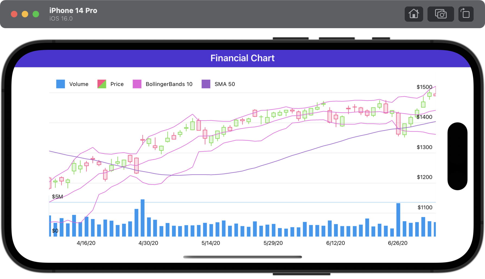

# DevExpress Financial Chart for .NET MAUI

This example demonstrates how to use DevExpress Charts for .NET MAUI to show financial data.

## Requirements

Please register the DevExpress NuGet Gallery in Visual Studio to restore the NuGet packages used in this solution. See the following topic for more information: [Get Started with DevExpress Mobile UI for .NET MAUI](https://docs.devexpress.com/MAUI/403249/get-started).

You can also refer to the following YouTube video for more information on how to get started with the DevExpress .NET MAUI Controls: [Setting up a .NET MAUI Project](https://www.youtube.com/watch?v=juJvl5UicIQ).

<!-- default file list -->
## Files to Review

* [MainPage.xaml](./MainPage.xaml)
* [SeriesData.cs](./Data/SeriesData.cs)
<!-- default file list end -->

## Documentation

* [CandleStickSeries](https://docs.devexpress.com/MAUI/DevExpress.Maui.Charts.CandleStickSeries)
* [BollingerBandsIndicator](https://docs.devexpress.com/MAUI/DevExpress.Maui.Charts.BollingerBandsIndicator)
* [MovingAverageIndicator](https://docs.devexpress.com/MAUI/DevExpress.Maui.Charts.MovingAverageIndicator)