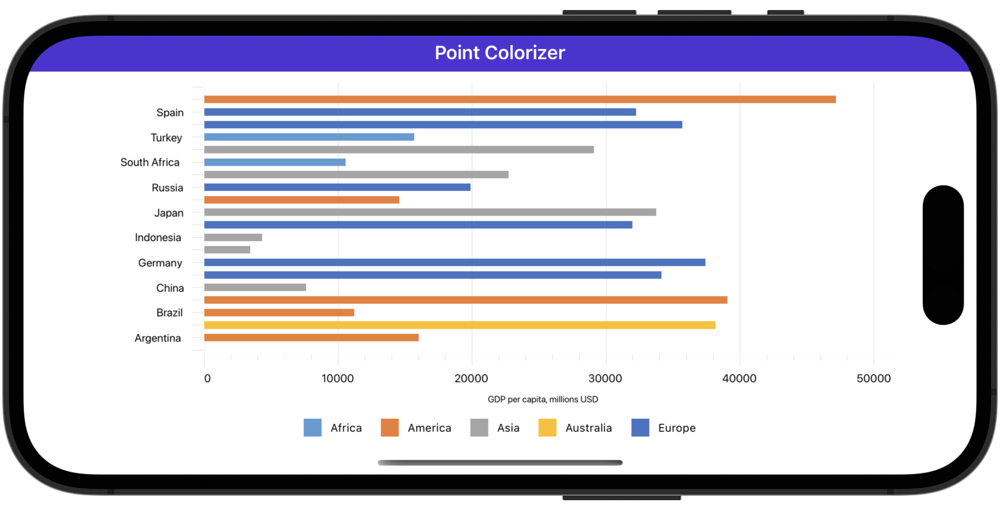

# Color Points by Data Source Values

In this example, the bar chart visualizes GDP values for the G20 and colors data points according to which part of the world the country belongs. 

## Requirements

Please register the DevExpress NuGet Gallery in Visual Studio to restore the NuGet packages used in this solution. See the following topic for more information: [Get Started with DevExpress Mobile UI for .NET MAUI](https://docs.devexpress.com/MAUI/403249/get-started).

You can also refer to the following YouTube video for more information on how to get started with the DevExpress .NET MAUI Controls: [Setting up a .NET MAUI Project](https://www.youtube.com/watch?v=juJvl5UicIQ).

<!-- default file list -->
## Files to Review

* [MainPage.xaml](./MainPage.xaml)
* [ViewModel.cs](./ViewModel.cs)
<!-- default file list end -->

## Documentation

[IIndexBasedCustomPointColorizer](https://docs.devexpress.com/MAUI/DevExpress.Maui.Charts.IIndexBasedCustomPointColorizer)