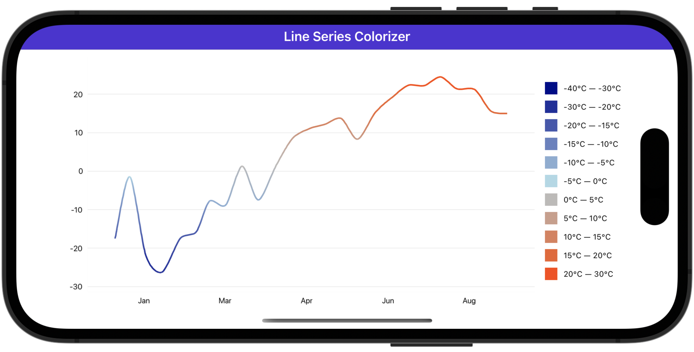

# Colorize Line Segments

In this example, the spline chart displays the temperature curve colored based on ranges of temperature values. 

Follow the steps below to create a similar chart:

* Add a [SplineSeries](https://docs.devexpress.com/MAUI/DevExpress.Maui.Charts.SplineSeries) object to the [ChartView.Series](https://docs.devexpress.com/MAUI/DevExpress.Maui.Charts.ChartView.Series) collection, and specify its [Data](https://docs.devexpress.com/MAUI/DevExpress.Maui.Charts.XYSeries.Data) property to bind the series to a data source.

* Initialize the bar series' [SegmentColorizer](https://docs.devexpress.com/MAUI/DevExpress.Maui.Charts.LineSeries.SegmentColorizer) property with a [GradientPointBasedSegmentColorizer](https://docs.devexpress.com/MAUI/DevExpress.Maui.Charts.GradientPointBasedSegmentColorizer) object.

* Assign a [ValueBandPointColorizer](https://docs.devexpress.com/MAUI/DevExpress.Maui.Charts.ValueBandPointColorizer) object to the [GradientPointBasedSegmentColorizer.PointColorizer](https://docs.devexpress.com/MAUI/DevExpress.Maui.Charts.GradientPointBasedSegmentColorizer.PointColorizer) property. Populate the colorizer's [ColorStops](https://docs.devexpress.com/MAUI/DevExpress.Maui.Charts.GradientPointBasedSegmentColorizer.PointColorizer) collection with [ColorStop](https://docs.devexpress.com/MAUI/DevExpress.Maui.Charts.ColorStop) objects that specify colors for ranges of temperature values.

<!-- default file list -->
## Files to Review

* [MainPage.xaml](./MainPage.xaml)
* [ViewModel.cs](./ViewModel.cs)
<!-- default file list end -->

## Documentation

* [ChartView](https://docs.devexpress.com/MAUI/DevExpress.Maui.Charts.ChartView)
* [GradientPointBasedSegmentColorizer](https://docs.devexpress.com/MAUI/DevExpress.Maui.Charts.GradientPointBasedSegmentColorizer)
