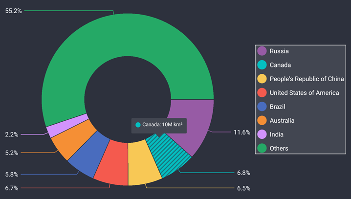

<!-- default file list -->
*Files to look at*:

* [Startup.cs](./PieChartExample/PieChartExample/Startup.cs)
* [MainPage.xaml](./PieChartExample/PieChartExample/MainPage.xaml)
* [ViewModel.cs](./PieChartExample/PieChartExample/ViewModel.cs)
<!-- default file list end -->

# DevExpress Pie Chart for .NET MAUI

The DevExpress Pie Chart for .NET MAUI Preview 5 visualizes data as a circle chart divided into slices to illustrate numerical proportion.

This example allows you to get started with the PieChartView component and explore its basic functionality.  

Open the solution in Visual Studio 16.11 Preview 2 and restore NuGet packages to run the application:

1. [Obtain your NuGet feed URL](http://docs.devexpress.com/GeneralInformation/116042/installation/install-devexpress-controls-using-nuget-packages/obtain-your-nuget-feed-url).
2. Register the DevExpress NuGet feed as a package source.
3. Restore all NuGet packages for the solution.

Run the application on an Android device or emulator in portrait orientation.



The following step-by-step instructions describe how to create the same application.

## Create a New MAUI Application and Add a Pie Chart

Create a new .NET MAUI solution in Visual Studio 16.11 Preview 2.  
Refer to the following Microsoft documentation for more information on how to get started with .NET MAUI: [.NET Multi-platform App UI](https://docs.microsoft.com/en-gb/dotnet/maui/).

Add the DevExpress Charts component to your solution as follows: 
1. [Obtain your NuGet feed URL](http://docs.devexpress.com/GeneralInformation/116042/installation/install-devexpress-controls-using-nuget-packages/obtain-your-nuget-feed-url).
2. Register the DevExpress NuGet feed as a package source. 
3. Install the **DevExpress.MAUI.Charts** package from the DevExpress NuGet feed.

In the *Startup.cs* file, register a handler for the DevExpress PieChartView:

```cs
using Microsoft.Maui;
using Microsoft.Maui.Hosting;
using Microsoft.Maui.Controls.Hosting;
using DevExpress.Maui.Charts;

namespace PieChartExample {
	public class Startup : IStartup {
		public void Configure(IAppHostBuilder appBuilder) {
			appBuilder
				.ConfigureMauiHandlers((_, handlers) => 
                                        handlers.AddHandler<PieChartView, PieChartViewHandler>())
				.UseMauiApp<App>()
				.ConfigureFonts(fonts => {
					fonts.AddFont("OpenSans-Regular.ttf", "OpenSansRegular");
				});
		}
	}
}
```

In the *MainPage.xaml* file, use the *dxc* prefix to declare the **DevExpress.Maui.Charts** namespace and add a **PieChartView** instance to the ContentPage:
```xaml
<ContentPage xmlns="http://schemas.microsoft.com/dotnet/2021/maui"
             xmlns:x="http://schemas.microsoft.com/winfx/2009/xaml"
             x:Class="PieChartExample.MainPage"
             xmlns:dxc="clr-namespace:DevExpress.Maui.Charts;assembly=DevExpress.Maui.Charts">
        <dxc:PieChartView>
        </dxc:PieChartView>
</ContentPage>
```

## Populate the Pie Chart with Data
In this example, the pie chart compares countries by area. Create a *ViewModel.cs* file with the following classes: 

```cs
using System.Collections.Generic;
using Microsoft.Maui.Graphics;

class ViewModel {
    public IReadOnlyList<LandAreaItem> LandAreas { get; }

    public ViewModel() {
        LandAreas = new List<LandAreaItem>() {
            new LandAreaItem("Russia", 17.098),
            new LandAreaItem("Canada", 9.985),
            new LandAreaItem("People's Republic of China", 9.597),
            new LandAreaItem("United States of America", 9.834),
            new LandAreaItem("Brazil", 8.516),
            new LandAreaItem("Australia", 7.692),
            new LandAreaItem("India", 3.287),
            new LandAreaItem("Others", 81.2)
        };
    }
}

class LandAreaItem {
    public string CountryName { get; }
    public double Area { get; }

    public LandAreaItem(string countryName, double area) {
        this.CountryName = countryName;
        this.Area = area;
    }
}
```

In the *MainPage.xaml* file, add a new **DonutSeries** object to the **PieChartView.Series** collection. To bind the series to data, set the **DonutSeries.Data** property to a **PieSeriesDataAdapter** object. Use the adapter’s properties to specify the data source and its fields that contain values and labels for series points:

```xaml
<ContentPage xmlns="http://schemas.microsoft.com/dotnet/2021/maui"
             xmlns:x="http://schemas.microsoft.com/winfx/2009/xaml"
             x:Class="PieChartExample.MainPage"
             xmlns:local="clr-namespace:PieChartExample"
             xmlns:dxc="clr-namespace:DevExpress.Maui.Charts;assembly=DevExpress.Maui.Charts">
    <ContentPage.BindingContext>
        <local:ViewModel/>
    </ContentPage.BindingContext>
    <dxc:PieChartView>
        <dxc:PieChartView.Series>
            <dxc:DonutSeries>
                <dxc:DonutSeries.Data>
                    <dxc:PieSeriesDataAdapter DataSource="{Binding LandAreas}"
                                              LabelDataMember="CountryName"
                                              ValueDataMember="Area"/>
                </dxc:DonutSeries.Data>
            </dxc:DonutSeries>
        </dxc:PieChartView.Series>
    </dxc:PieChartView>
</ContentPage>
```

## Add a Legend to the Pie Chart
Create a **Legend** object, modify its settings, and assign it to the **PieChartView.Legend** property:

```xaml
<dxc:PieChartView>
    <!--...-->
    <dxc:PieChartView.Legend>
        <dxc:Legend Orientation="TopToBottom"
                    HorizontalPosition="Center"
                    VerticalPosition="BottomOutside"/>
    </dxc:PieChartView.Legend>
</dxc:PieChartView>
```

## Enable Series Labels
Set the **DonutSeries.Label** property to a **PieSeriesLabel** object with the specified **TextPattern**, **Position**, and **Indent** settings:
```xaml
<dxc:PieChartView>
    <dxc:PieChartView.Series>
        <dxc:DonutSeries>
            <!--...-->
            <dxc:DonutSeries.Label>
                <dxc:PieSeriesLabel TextPattern="{}{VP}%" Position="TwoColumns" Indent="20"/>
            </dxc:DonutSeries.Label>
        </dxc:DonutSeries>
    </dxc:PieChartView.Series>
</dxc:PieChartView>
```

## Enable Tooltips for Chart Segments
To show hints, set the **PieChartView.Hint** property to a **PieHint** object with its **Enabled** property set to **True**:
```xaml
<dxc:PieChartView>
    <dxc:PieChartView.Hint>
        <dxc:PieHint Enabled="True"/>
    </dxc:PieChartView.Hint>
    <!--...-->
</dxc:PieChartView>
```

Specify the text pattern for tooltips of donut segments:
```xaml
<dxc:PieChartView>
    <!--...-->
    <dxc:PieChartView.Series>
        <dxc:DonutSeries>
            <!--...-->
            <dxc:DonutSeries.HintOptions>
                <dxc:PieSeriesHintOptions PointTextPattern="{}{L}: {V}M km²"/>
            </dxc:DonutSeries.HintOptions>
        </dxc:DonutSeries>
    </dxc:PieChartView.Series>
</dxc:PieChartView>
```

## Modify the Pie Chart Appearance

In the view model, define a palette of custom colors for donut segments:
```cs
using Microsoft.Maui.Graphics;
// ...
class ViewModel {
    // ...
    readonly Color[] palette;
    public Color[] Palette => palette;

    public ViewModel() {
        // ...
        palette = PaletteLoader.LoadPalette("#975ba5", "#03bfc1", "#f8c855", "#f45a4e",
                                            "#496cbe", "#f58f35", "#d293fd", "#25a966");}
}

static class PaletteLoader {
    public static Color[] LoadPalette(params string[] values) {
        Color[] colors = new Color[values.Length];
        for (int i = 0; i < values.Length; i++)
            colors[i] = Color.FromArgb(values[i]);
        return colors;
    }
}
```

Set the **PieChartView.ChartStyle** property to a **PieChartStyle** object with the specified **Palette** and **BackgroundColor** properties to modify the chart's color scheme:
```xaml
<ContentPage>
    <ContentPage.BindingContext>
        <local:ViewModel/>
    </ContentPage.BindingContext>
    <dxc:PieChartView>
        <!--...-->
        <dxc:PieChartView.ChartStyle>
            <dxc:PieChartStyle Palette="{Binding Palette}" 
                               BackgroundColor="#2d313d"/>
        </dxc:PieChartView.ChartStyle>
    </dxc:PieChartView>
</ContentPage>
```

Use the **PieChartView.SelectionBehavior** property to specify how to highlight a donut segment when a user selects it:
```xaml
<dxc:PieChartView SelectionBehavior="Hatch">
    <!--...-->
</dxc:PieChartView>
```

To change the legend appearance, set the **Legend.Style** property to a **LegendStyle** object, and specify this object's properties that customize the legend border, background and items:
```xaml
<dxc:PieChartView.Legend>
    <dxc:Legend>
        <dxc:Legend.Style>
            <dxc:LegendStyle BorderColor="LightGray" BorderThickness="1"
                             BackgroundColor="#424651"
                             MarkerSize="18" TextIndent="6"
                             ItemsVerticalIndent="12">
                <dxc:LegendStyle.TextStyle>
                    <dxc:TextStyle Color="White" Size="12"/>
                </dxc:LegendStyle.TextStyle>
            </dxc:LegendStyle>
        </dxc:Legend.Style>
    </dxc:Legend>
</dxc:PieChartView.Legend>
```

Change text settings and connector thickness for the pie chart's labels. To do this, set the **PieSeriesLabel.Style** property to a **PieSeriesLabelStyle** object with the specified **TextStyle** and **ConnectorThickness** properties:
```xaml
<dxc:PieChartView>
    <dxc:PieChartView.Series>
            <dxc:DonutSeries>
                <!--...-->
                <dxc:DonutSeries.Label>
                    <dxc:PieSeriesLabel Position="TwoColumns" TextPattern="{}{VP}%" Indent="20">
                        <dxc:PieSeriesLabel.Style>
                            <dxc:PieSeriesLabelStyle ConnectorThickness="1">
                                <dxc:PieSeriesLabelStyle.TextStyle>
                                    <dxc:TextStyle Color="#eff2f6" Size="12"/>
                                </dxc:PieSeriesLabelStyle.TextStyle>
                            </dxc:PieSeriesLabelStyle>
                        </dxc:PieSeriesLabel.Style>
                    </dxc:PieSeriesLabel>
                </dxc:DonutSeries.Label>
        </dxc:DonutSeries>
    </dxc:PieChartView.Series>
</dxc:PieChartView>
```

Use the **BackgroundColor** property to change the background of hints:
```xaml
<dxc:PieChartView>
    <dxc:PieChartView.Hint>
        <dxc:PieHint Enabled="True">
            <dxc:PieHint.Style>
                <dxc:PieHintStyle BackgroundColor="#424651"/>
            </dxc:PieHint.Style>
        </dxc:PieHint>
    </dxc:PieChartView.Hint>
</dxc:PieChartView>
```
