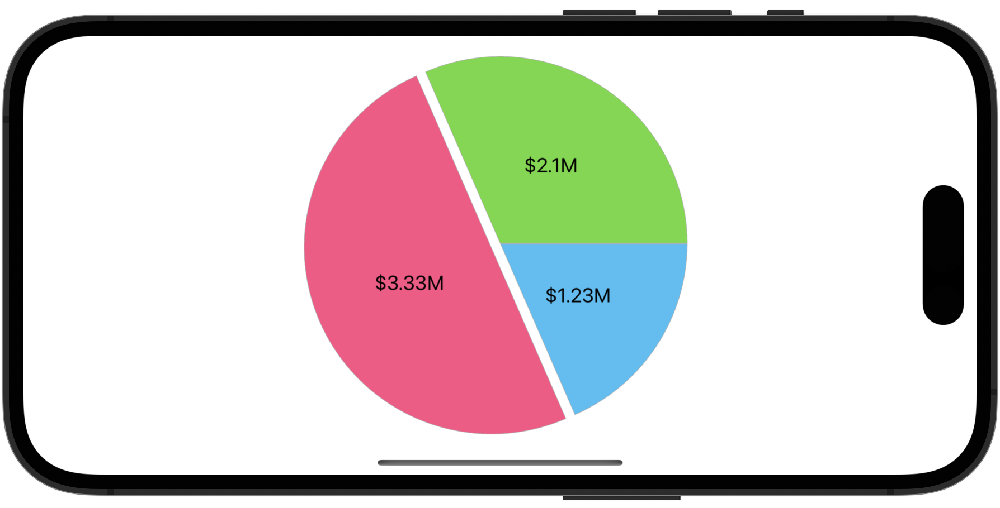

# Apply a Custom Format to Pie Slice Labels

This example configures pie chart settings and runtime, and shows how to create a custom formatter for point labels.



To create a custom formatter for label text, do the following:

* Create a class that implements the [ISeriesLabelTextProvider](https://docs.devexpress.com/MAUI/DevExpress.Maui.Charts.ISeriesLabelTextProvider) interface.
* Implement its [ISeriesLabelTextProvider.GetText](https://docs.devexpress.com/MAUI/DevExpress.Maui.Charts.ISeriesLabelTextProvider.GetText(DevExpress.Maui.Charts.SeriesLabelValuesBase)) method so that it formats label text depending on the point value in the following way:

* _1234_ -> _$1.234K_
* _123456789_ -> _$123.457M_
* _12345678901_ -> _$12.346B_

```cs
public class LabelTextProvider : ISeriesLabelTextProvider {
    string ISeriesLabelTextProvider.GetText(SeriesLabelValuesBase values) {
        if (values is PieSeriesLabelValues seriesValues) {
            double v = seriesValues.Value;
            if (v >= 1000000000 || v <= -1000000000)
                return (v / 1000000000.0).ToString("$#.###B", CultureInfo.InvariantCulture);
            else if (v >= 1000000 || v <= -1000000)
                return (v / 1000000.0).ToString("$#.###M", CultureInfo.InvariantCulture);
            else if (v >= 1000 || v <= -1000)
                return (v / 1000.0).ToString("$#.###K", CultureInfo.InvariantCulture);
            else
                return v.ToString();
        }
        return String.Empty;
    }
}
```


<!-- default file list -->
## Files to Review

* [MainPage.xaml](./MainPage.xaml)
* [MainPage.xaml.cs](./MainPage.xaml.cs)
<!-- default file list end -->

## Documentation

* [ISeriesLabelTextProvider](https://docs.devexpress.com/MAUI/DevExpress.Maui.Charts.ISeriesLabelTextProvider)