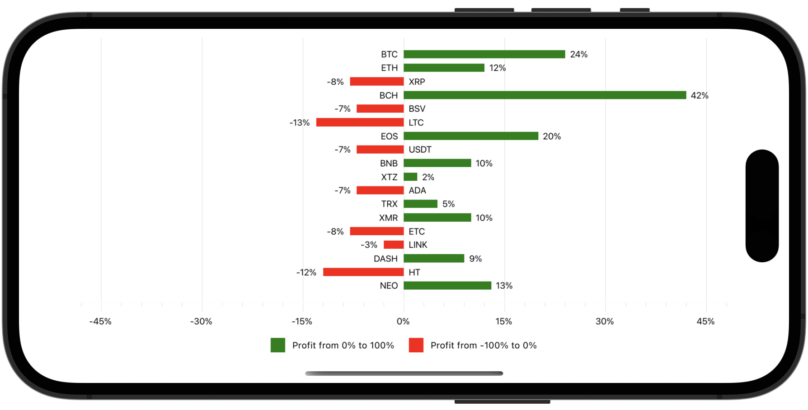

# Color Points by Their Values

In this example, the bar chart displays cryptocurrency portfolio yield. It colors series points red when their Y-axis values are between **-100** and **0**, and green when values are between **0** and **100**. Note that this chart diagram is [rotated](https://docs.devexpress.com/MAUI/DevExpress.Maui.Charts.ChartView.Rotated?p=netframework). 



Follow the steps below to create a similar chart:

* Add a [BarSeries](https://docs.devexpress.com/MAUI/DevExpress.Maui.Charts.SplineSeries) object to the [ChartView.Series](https://docs.devexpress.com/MAUI/DevExpress.Maui.Charts.ChartView.Series) collection, and specify its [Data](https://docs.devexpress.com/MAUI/DevExpress.Maui.Charts.XYSeries.Data) property to bind the series to a data source.

* Assign a [ValueBandPointColorizer](https://docs.devexpress.com/MAUI/DevExpress.Maui.Charts.ValueBandPointColorizer) object to the [BarSeries.PointColorizer](https://docs.devexpress.com/MAUI/DevExpress.Maui.Charts.BarSeries.PointColorizer) property. 

* To specify color boundaries, populate the colorizer's [ColorStops](https://docs.devexpress.com/MAUI/DevExpress.Maui.Charts.BandPointColorizerBase.ColorStops) collection with [ColorStop](https://docs.devexpress.com/MAUI/DevExpress.Maui.Charts.ColorStop) objects.

    ```xaml
    <dxc:BarSeries.PointColorizer>
        <dxc:ValueBandPointColorizer>
            <dxc:ValueBandPointColorizer.ColorStops>
                <dxc:ColorStop Color="Green" Value1="0" Value2="100"/>
                <dxc:ColorStop Color="Red" Value1="0" Value2="-100"/>
            </dxc:ValueBandPointColorizer.ColorStops>
        </dxc:ValueBandPointColorizer>
    </dxc:BarSeries.PointColorizer>
    ```


<!-- default file list -->
## Files to Review

* [MainPage.xaml](./MainPage.xaml)
* [ViewModel.cs](./ViewModel.cs)
<!-- default file list end -->

## Documentation

* [ChartView](https://docs.devexpress.com/MAUI/DevExpress.Maui.Charts.ChartView)
* [ValueBandPointColorizer](https://docs.devexpress.com/MAUI/DevExpress.Maui.Charts.ValueBandPointColorizer)
