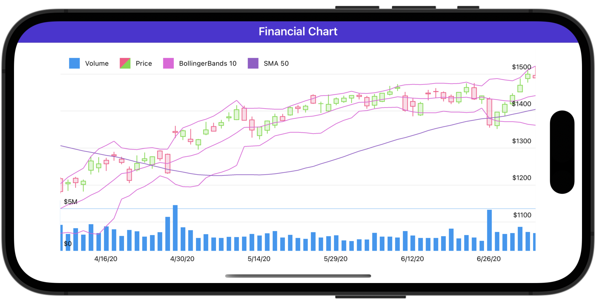

<!-- default badges list -->

<!-- default badges end -->
# DevExpress Charts for .NET MAUI

The [DevExpress Mobile UI](https://www.devexpress.com/maui/) allows you to use a .NET cross-platform UI toolkit and C# to build native apps for iOS and Android.

The **DevExpress Mobile UI for Xamarin.Forms and .NET MAUI** is free of charge. To learn more about our offer and to obtain your copy, visit [Free DevExpress Mobile UI for Xamarin.Forms and .NET MAUI](https://www.devexpress.com/xamarin-free).

## Requirements

Please register the DevExpress NuGet Gallery in Visual Studio to restore the NuGet packages used in this solution. See the following topic for more information: [Get Started with DevExpress Mobile UI for .NET MAUI](https://docs.devexpress.com/MAUI/403249/get-started). 

You can also refer to the following YouTube videos for more information on how to get started with the DevExpress .NET MAUI Controls and DevExpress Chart Controls for MAUI: 

* [Setting up a .NET MAUI Project](https://www.youtube.com/watch?v=juJvl5UicIQ)
* [Adding Charts to Your .NET MAUI App](https://www.youtube.com/watch?v=uvcMy2WP0_M)

## What's in This Repository

This repository contains projects that allow you to create different charts.

### Create Charts

* [Financial Chart](./CS/FinancialChart)
* [Pie Chart](./CS/PieChartGetStarted)
* [Scatter Chart](./CS/ScatterChartGetStarted)

### Paint Charts

* [Fill Area Chart by Segments](./CS/AreaSegmentColorizer)
* [Paint Points with Palette Colors](./CS/ColorEachPointColorizer)
* [Color Points by Their Arguments](./CS/CustomPointColorizer)
* [Paint Bubbles Based on Data Source Field Value Ranges](./CS/CustomValueRangeColorizer)
* [Color Points Based on String Data Source Values](./CS/IndexBasedCustomPointColorizer)
* [Colorize Line Segments](./CS/LineSegmentColorizer)
* [Color Points by Their Values](./CS/ValueRangeColorizer)

### Configure Chart Elements

* [Apply a Custom Format to Pie Slice Labels](./CS/SeriesLabelTextProvider)

## Documentation

* [Prerequisites for .NET MAUI and DevExpress Mobile UI](https://docs.devexpress.com/MAUI/404022/prerequisites)
* [Get Started](https://docs.devexpress.com/MAUI/403249/get-started/get-started)
* [Charts](https://docs.devexpress.com/MAUI/403300/charts/charts)

## More Examples

* [Stocks App](https://github.com/DevExpress-Examples/maui-stocks-mini)
* [Data Grid](https://github.com/DevExpress-Examples/maui-data-grid-get-started)
* [Data Form](https://github.com/DevExpress-Examples/maui-data-form-get-started)
* [Data Editors](https://github.com/DevExpress-Examples/maui-editors-get-started)
* [Scheduler](https://github.com/DevExpress-Examples/maui-scheduler-get-started)
* [Tab Page](https://github.com/DevExpress-Examples/maui-tab-page-get-started)
* [Tab View](https://github.com/DevExpress-Examples/maui-tab-view-get-started)
* [Drawer Page](https://github.com/DevExpress-Examples/maui-drawer-page-get-started)
* [Drawer View](https://github.com/DevExpress-Examples/maui-drawer-view-get-started)
* [Collection View](https://github.com/DevExpress-Examples/maui-collection-view-get-started)
* [Popup](https://github.com/DevExpress-Examples/maui-popup-get-started)
<!-- feedback -->
## Does this example address your development requirements/objectives?

 

(you will be redirected to DevExpress.com to submit your response)
<!-- feedback end -->
