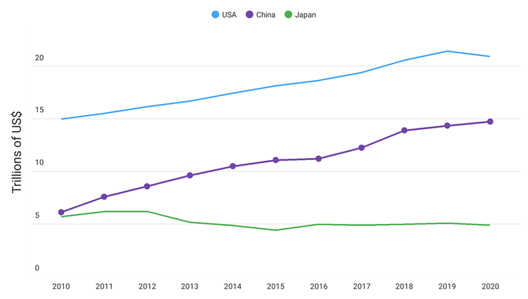

<!-- default badges list -->

[](https://supportcenter.devexpress.com/ticket/details/T1020671)
[](https://docs.devexpress.com/GeneralInformation/403183)
<!-- default badges end -->
# DevExpress Scatter Chart for .NET MAUI

[DevExpress Mobile UI](https://www.devexpress.com/maui/) allows you to use a .NET cross-platform UI toolkit and C# to build native apps for iOS and Android.


The **DevExpress Mobile UI for Xamarin.Forms and .NET MAUI** is free of charge. To learn more about our offer and to reserve your copy, visit [Free DevExpress Mobile UI for Xamarin.Forms and .NET MAUI](https://www.devexpress.com/xamarin-free).

## Requirements

Please register the DevExpress NuGet Gallery in Visual Studio to restore the NuGet packages used in this solution. See the following topic for more information: [Get Started with DevExpress Mobile UI for .NET MAUI](https://docs.devexpress.com/MAUI/403249/get-started).

## Documentation

- [Data Grid](https://docs.devexpress.com/MAUI/403255/data-grid/data-grid)
- [Charts](https://docs.devexpress.com/MAUI/403300/charts/charts)
- [Data Form](https://docs.devexpress.com/MAUI/403640/data-form)
- [Navigation](https://docs.devexpress.com/MAUI/403297/navigation/index)
- [Data Editors](https://docs.devexpress.com/MAUI/403427/editors/index)
- [Collection View](https://docs.devexpress.com/MAUI/403324/collection-view/index)

## More Examples

* [Stocks App](https://github.com/DevExpress-Examples/maui-stocks-mini)
* [Data Grid](https://github.com/DevExpress-Examples/maui-data-grid-get-started)
* [Data Form](https://github.com/DevExpress-Examples/maui-data-form-get-started)
* [Data Editors](https://github.com/DevExpress-Examples/maui-editors-get-started)
* [Pie Chart](https://github.com/DevExpress-Examples/maui-pie-chart-get-started)
* [Tab View](https://github.com/DevExpress-Examples/maui-tab-view-get-started)
* [Collection View](https://github.com/DevExpress-Examples/maui-collection-view-get-started)

## What's in This Repository

The [ChartView](https://docs.devexpress.com/MAUI/DevExpress.Maui.Charts.ChartView) component can visualize data in a [Cartesian coordinate system](https://en.wikipedia.org/wiki/Cartesian_coordinate_system) as areas, bars, points, bubbles, lines, and other forms. This example allows you to get started with the [ChartView](https://docs.devexpress.com/MAUI/DevExpress.Maui.Charts.ChartView) component and explore its basic functionality. It demonstrates how to add data series to a chart, configure axes, specify the chart's elements (legend, series labels, and hints), and customize series appearance.



### Files to Look At

<!-- default file list -->
* [MauiProgram.cs](./CS/ScatterChartGetStarted/MauiProgram.cs)
* [MainPage.xaml](./CS/ScatterChartGetStarted/MainPage.xaml)
* [ViewModel.cs](./CS/ScatterChartGetStarted/ViewModel.cs)
<!-- default file list end -->

## How to Run This Application

1. Install Visual Studio 2022 and the latest .NET MAUI version. See the following topic on docs.microsoft.com for more information: [.NET MAUI Installation](https://docs.microsoft.com/en-gb/dotnet/maui/get-started/installation).
1. Register the following NuGet feed in Visual Studio: `https://nuget.devexpress.com/free/api`.
    > If you are an active [DevExpress Universal](https://www.devexpress.com/subscriptions/universal.xml) customer, DevExpress Controls for .NET MAUI are available in your [personal NuGet feed](https://nuget.devexpress.com/).

## How to Reproduce This Application

The following step-by-step tutorial details how to reproduce this application.

### Create a New Project

1. In Visual Studio 2022, create a new .NET MAUI project. Name it *ChartViewExample*.
    > If the wizard does not propose a template for .NET MAUI projects, you can call the following command in a CLI to create a new .NET MAUI project:
    > ```
    > dotnet new maui -n ChartViewExample
    > ```
1. Install the **DevExpress.Maui.Charts** package from the DevExpress NuGet Gallery.
> DevExpress Pie Chart for .NET MAUI supports iOS and Android. The project should only contain these platforms.

### Add a Chart View to the Main Page

In the *MauiProgram.cs* file, call the **UseDevExpress** method to register handlers for the `ChartView` and other DevExpress controls:
```cs
using Microsoft.Maui;
using Microsoft.Maui.Hosting;
using Microsoft.Maui.Controls.Hosting;
using DevExpress.Maui.Charts;

namespace ScatterChartGetStarted {
    public static class MauiProgram {
        public static MauiApp CreateMauiApp() {
            var builder = MauiApp.CreateBuilder();
            builder
                .UseMauiApp<App>()
                .UseDevExpress()
                .ConfigureFonts(fonts => {
                    fonts.AddFont("OpenSans-Regular.ttf", "OpenSansRegular");
                });
            return builder.Build();
        }
    }
}
```
In the *MainPage.xaml* file, use the *dxc* prefix to declare the **DevExpress.Maui.Charts** namespace and add a [ChartView](https://docs.devexpress.com/MAUI/DevExpress.Maui.Charts.ChartView) instance to the ContentPage:
```xaml
<ContentPage xmlns="http://schemas.microsoft.com/dotnet/2021/maui"
             xmlns:x="http://schemas.microsoft.com/winfx/2009/xaml"
             x:Class="ChartViewExample.MainPage"
             xmlns:dxc="clr-namespace:DevExpress.Maui.Charts;assembly=DevExpress.Maui.Charts">
    <dxc:ChartView/>
</ContentPage>
```

### Populate the Chart with Data
In this example, the chart contains three line series that show annual GDP for three countries. Create a *ViewModel.cs* file with the following classes:

```cs
public class ViewModel {
    public CountryGdp GdpValueForUSA { get; }
    public CountryGdp GdpValueForChina { get; }
    public CountryGdp GdpValueForJapan { get; }
    
    public ViewModel() {
        GdpValueForUSA = new CountryGdp(
            "USA",
            new GdpValue(new DateTime(2020, 1, 1), 20.93),
            new GdpValue(new DateTime(2019, 1, 1), 21.43),
            new GdpValue(new DateTime(2018, 1, 1), 20.58),
            new GdpValue(new DateTime(2017, 1, 1), 19.391),
            new GdpValue(new DateTime(2016, 1, 1), 18.624),
            new GdpValue(new DateTime(2015, 1, 1), 18.121),
            new GdpValue(new DateTime(2014, 1, 1), 17.428),
            new GdpValue(new DateTime(2013, 1, 1), 16.692),
            new GdpValue(new DateTime(2012, 1, 1), 16.155),
            new GdpValue(new DateTime(2011, 1, 1), 15.518),
            new GdpValue(new DateTime(2010, 1, 1), 14.964)
        );
        GdpValueForChina = new CountryGdp(
            "China",
            new GdpValue(new DateTime(2020, 1, 1), 14.72),
            new GdpValue(new DateTime(2019, 1, 1), 14.34),
            new GdpValue(new DateTime(2018, 1, 1), 13.89),
            new GdpValue(new DateTime(2017, 1, 1), 12.238),
            new GdpValue(new DateTime(2016, 1, 1), 11.191),
            new GdpValue(new DateTime(2015, 1, 1), 11.065),
            new GdpValue(new DateTime(2014, 1, 1), 10.482),
            new GdpValue(new DateTime(2013, 1, 1), 9.607),
            new GdpValue(new DateTime(2012, 1, 1), 8.561),
            new GdpValue(new DateTime(2011, 1, 1), 7.573),
            new GdpValue(new DateTime(2010, 1, 1), 6.101)
        );
        GdpValueForJapan = new CountryGdp(
            "Japan",
            new GdpValue(new DateTime(2020, 1, 1), 4.888),
            new GdpValue(new DateTime(2019, 1, 1), 5.082),
            new GdpValue(new DateTime(2018, 1, 1), 4.955),
            new GdpValue(new DateTime(2017, 1, 1), 4.872),
            new GdpValue(new DateTime(2016, 1, 1), 4.949),
            new GdpValue(new DateTime(2015, 1, 1), 4.395),
            new GdpValue(new DateTime(2014, 1, 1), 4.850),
            new GdpValue(new DateTime(2013, 1, 1), 5.156),
            new GdpValue(new DateTime(2012, 1, 1), 6.203),
            new GdpValue(new DateTime(2011, 1, 1), 6.156),
            new GdpValue(new DateTime(2010, 1, 1), 5.700)
        );
    }
}

public class CountryGdp {
    public string CountryName { get; }
    public IList<GdpValue> Values { get; }

    public CountryGdp(string country, params GdpValue[] values) {
        this.CountryName = country;
        this.Values = new List<GdpValue>(values);
    }
}

public class GdpValue {
    public DateTime Year { get; }
    public double Value { get; }

    public GdpValue(DateTime year, double value) {
        this.Year = year;
        this.Value = value;
    }
}
```

In the *MainPage.xaml* file, add three [LineSeries](https://docs.devexpress.com/MAUI/DevExpress.Maui.Charts.LineSeries) objects to the [ChartView.Series](https://docs.devexpress.com/MAUI/DevExpress.Maui.Charts.ChartView.Series) collection. To bind series to data, set the [Data](https://docs.devexpress.com/MAUI/DevExpress.Maui.Charts.XYSeries.Data) property of each [LineSeries](https://docs.devexpress.com/MAUI/DevExpress.Maui.Charts.LineSeries) object to a [SeriesDataAdapter](https://docs.devexpress.com/MAUI/DevExpress.Maui.Charts.SeriesDataAdapter) object. Use the adapter’s properties to specify the data source and its fields that contain arguments and values for each series:

```xaml
<ContentPage xmlns="http://schemas.microsoft.com/dotnet/2021/maui"
             xmlns:x="http://schemas.microsoft.com/winfx/2009/xaml"
             x:Class="ChartViewExample.MainPage"
             xmlns:local="clr-namespace:ChartViewExample"
             xmlns:dxc="clr-namespace:DevExpress.Maui.Charts;assembly=DevExpress.Maui.Charts">
    <ContentPage.BindingContext>
        <local:ViewModel/>
    </ContentPage.BindingContext>
    <dxc:ChartView>
        <dxc:ChartView.Series>
            <dxc:LineSeries DisplayName="{Binding GdpValueForUSA.CountryName}">
                <dxc:LineSeries.Data>
                    <dxc:SeriesDataAdapter DataSource="{Binding GdpValueForUSA.Values}"
                                           ArgumentDataMember="Year">
                        <dxc:ValueDataMember Type="Value" Member="Value"/>
                    </dxc:SeriesDataAdapter>
                </dxc:LineSeries.Data>
            </dxc:LineSeries>

            <dxc:LineSeries DisplayName="{Binding GdpValueForChina.CountryName}">
                <dxc:LineSeries.Data>
                    <dxc:SeriesDataAdapter DataSource="{Binding GdpValueForChina.Values}"
                                           ArgumentDataMember="Year">
                        <dxc:ValueDataMember Type="Value" Member="Value"/>
                    </dxc:SeriesDataAdapter>
                </dxc:LineSeries.Data>
            </dxc:LineSeries>

            <dxc:LineSeries DisplayName="{Binding GdpValueForJapan.CountryName}">
                <dxc:LineSeries.Data>
                    <dxc:SeriesDataAdapter DataSource="{Binding GdpValueForJapan.Values}"
                                           ArgumentDataMember="Year">
                        <dxc:ValueDataMember Type="Value" Member="Value"/>
                    </dxc:SeriesDataAdapter>
                </dxc:LineSeries.Data>
            </dxc:LineSeries>
        </dxc:ChartView.Series>
    </dxc:ChartView>
</ContentPage>
```

### Configure Chart Axes
Assign a [DateTimeAxisX](https://docs.devexpress.com/MAUI/DevExpress.Maui.Charts.DateTimeAxisX) object with the specified settings to the [ChartView.AxisX](https://docs.devexpress.com/MAUI/DevExpress.Maui.Charts.ChartView.AxisX) property to configure the X-axis so that it shows labels for years:
```xaml
<dxc:ChartView>
    <dxc:ChartView.AxisX>
        <dxc:DateTimeAxisX MeasureUnit="Year" 
                           GridAlignment="Year" 
                           GridSpacing="1"/>
    </dxc:ChartView.AxisX>
</dxc:ChartView>
```

Set the [ChartView.AxisY](https://docs.devexpress.com/MAUI/DevExpress.Maui.Charts.ChartView.AxisY) property to a [NumericAxisY](https://docs.devexpress.com/MAUI/DevExpress.Maui.Charts.NumericAxisY) object, and specify this object's [Title](https://docs.devexpress.com/MAUI/DevExpress.Maui.Charts.AxisBase.Title) and [Label](https://docs.devexpress.com/MAUI/DevExpress.Maui.Charts.AxisBase.Label) properties to configure the title and labels of the Y-axis:
```xaml
<dxc:ChartView> 
<!-- The X-axis config is here. -->
    <dxc:ChartView.AxisY>
        <dxc:NumericAxisY>
            <dxc:NumericAxisY.Title>
                <dxc:AxisTitle Text="Trillions of US$">
                    <dxc:AxisTitle.Style>
                        <dxc:TitleStyle>
                            <dxc:TitleStyle.TextStyle>
                                <dxc:TextStyle Size="16"/>
                            </dxc:TitleStyle.TextStyle>
                        </dxc:TitleStyle>
                    </dxc:AxisTitle.Style>
                </dxc:AxisTitle>
            </dxc:NumericAxisY.Title>
            <dxc:NumericAxisY.Label>
                <dxc:AxisLabel TextFormat="#.#" Position="Inside"/>
            </dxc:NumericAxisY.Label>
        </dxc:NumericAxisY>
    </dxc:ChartView.AxisY>
</dxc:ChartView>
```

### Add a Legend to the Chart

Set the [ChartView.Legend](https://docs.devexpress.com/MAUI/DevExpress.Maui.Charts.ChartBaseView.Legend) property to a [Legend](https://docs.devexpress.com/MAUI/DevExpress.Maui.Charts.Legend) object, and use this object's properties to configure the legend position and orientation:
```xaml
<dxc:ChartView>
    <dxc:ChartView.Legend>
        <dxc:Legend VerticalPosition="BottomOutside" 
                    HorizontalPosition="Center" 
                    Orientation="LeftToRight"/>
    </dxc:ChartView.Legend>
</dxc:ChartView>
```

### Enable a Crosshair Cursor
Set up the chart so that it shows a series point hint as a crosshair cursor, and specify the hint’s content, data format, and visibility options.
1. Set the [ChartView.Hint](https://docs.devexpress.com/MAUI/DevExpress.Maui.Charts.ChartView.Hint) property to a [Hint](https://docs.devexpress.com/MAUI/DevExpress.Maui.Charts.Hint) object, and assign a [CrosshairHintBehavior](https://docs.devexpress.com/MAUI/DevExpress.Maui.Charts.CrosshairHintBehavior) object to [Hint.Behavior](https://docs.devexpress.com/MAUI/DevExpress.Maui.Charts.Hint.Behavior).
2. Set the [LineSeries.HintOptions](https://docs.devexpress.com/MAUI/DevExpress.Maui.Charts.Series.HintOptions) property to a [SeriesCrosshairOptions](https://docs.devexpress.com/MAUI/DevExpress.Maui.Charts.SeriesCrosshairOptions) object with the specified settings.

```xaml
<ContentPage.Resources>
    <dxc:SeriesCrosshairOptions x:Key="lineSeriesHintOptions"
                                PointTextPattern="{}{S}: {V}M"
                                ShowInLabel="True"
                                AxisLabelVisible="True"
                                AxisLineVisible="True"/>
</ContentPage.Resources>
<dxc:ChartView>
    <dxc:ChartView.Hint>
        <dxc:Hint>
            <dxc:Hint.Behavior>
                <dxc:CrosshairHintBehavior GroupHeaderTextPattern="{}{A$YYYY}" 
                                           MaxSeriesCount="3"/>
            </dxc:Hint.Behavior>
        </dxc:Hint>
    </dxc:ChartView.Hint>

    <dxc:ChartView.Series>
        <dxc:LineSeries HintOptions="{StaticResource lineSeriesHintOptions}">
            <!--Series Data-->
        </dxc:LineSeries>
        <dxc:LineSeries HintOptions="{StaticResource lineSeriesHintOptions}">
            <!--Series Data-->
        </dxc:LineSeries>
        <dxc:LineSeries HintOptions="{StaticResource lineSeriesHintOptions}">
            <!--Series Data-->
        </dxc:LineSeries>
    </dxc:ChartView.Series>    
</dxc:ChartView>
```

### Modify the Chart Appearance
Set the [LineSeries.MarkersVisible](https://docs.devexpress.com/MAUI/DevExpress.Maui.Charts.LineSeries.MarkersVisible) property to **True** to display point markers. To change the line series appearance, set the [LineSeries.Style](https://docs.devexpress.com/MAUI/DevExpress.Maui.Charts.LineSeries.Style) property to a [LineSeriesStyle](https://docs.devexpress.com/MAUI/DevExpress.Maui.Charts.LineSeriesStyle) object. This object’s properties allow you to configure the appearance of the series line ([Stroke](https://docs.devexpress.com/MAUI/DevExpress.Maui.Charts.LineSeriesStyle.Stroke), [StrokeThickness](https://docs.devexpress.com/MAUI/DevExpress.Maui.Charts.LineSeriesStyle.StrokeThickness)) and point markers ([MarkerSize](https://docs.devexpress.com/MAUI/DevExpress.Maui.Charts.PointSeriesStyle.MarkerSize), [MarkerStyle](https://docs.devexpress.com/MAUI/DevExpress.Maui.Charts.PointSeriesStyle.MarkerStyle)). 

```xaml
<dxc:LineSeries MarkersVisible="True">
    <!--Series Data-->
    <dxc:LineSeries.Style>
        <dxc:LineSeriesStyle Stroke="#7145a7" StrokeThickness="2" MarkerSize="8">
            <dxc:LineSeriesStyle.MarkerStyle>
                <dxc:MarkerStyle Fill="#7145a7"/>
            </dxc:LineSeriesStyle.MarkerStyle>
        </dxc:LineSeriesStyle>
    </dxc:LineSeries.Style>
</dxc:LineSeries>
```
